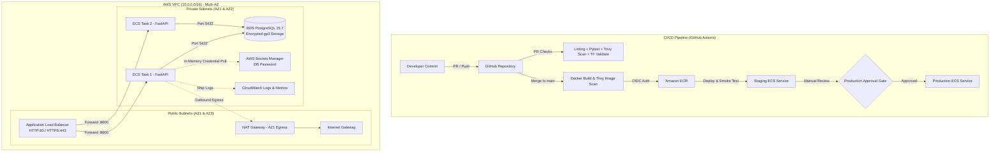

# 8Byte.ai DevOps / SRE Technical Assignment

**Author:** Sarthak Shirbhate (DevOps / SRE Engineer)  
**Repository:** [https://github.com/sarthak24shirbhate/8byte-devops-assignment](https://github.com/sarthak24shirbhate/8byte-devops-assignment)  
**Target Cloud:** AWS (us-east-1)  

---

## Overview

Hi team, this repository is my submission for the 8Byte.ai DevOps Engineer technical assignment. I have implemented a complete end-to-end pipeline and infrastructure stack covering:

1. **Infrastructure as Code (Terraform):** Multi-AZ VPC, Application Load Balancer, ECS Fargate tasks in private subnets, Amazon RDS PostgreSQL in isolated DB subnets, least-privilege security group chains, AWS Secrets Manager integration, and S3 remote state management.
2. **Application & Containerization:** A lightweight Python FastAPI microservice with structured JSON logging, `/health` endpoint for ALB health checks, `/api/v1/metrics` for operational telemetry, and PostgreSQL CRUD operations. Packaged via a multi-stage Dockerfile running as non-root (`appuser:10001`).
3. **CI/CD Automation (GitHub Actions):** Pull request validation (linting, pytest, Trivy dependency scan, terraform check), container security scanning, keyless AWS OIDC authentication, ECR push, automated deployment to Staging with smoke testing, and a manual approval gate before deploying to Production.
4. **Monitoring & Observability:** Centralized CloudWatch logging, two custom CloudWatch dashboards (Infrastructure Platform Health & Application Service Health), and metric alarms with Amazon SNS alerting.

---

## Architecture



---

## Project Structure

```
8byte-devops-assignment/
├── .github/
│   └── workflows/
│       ├── pr-validation.yml       # Runs lint, pytest, dependency scan, tf validate
│       └── deploy.yml              # Build, Trivy scan, ECR push, Staging, Approval, Prod
├── app/
│   ├── main.py                     # FastAPI service (/health, /api/v1/metrics, /api/v1/items)
│   ├── config.py                   # App configuration using Pydantic Settings
│   ├── database.py                 # SQLAlchemy session and engine management
│   ├── models.py                   # ORM models and Pydantic schemas
│   ├── requirements.txt            # Production runtime dependencies
│   └── requirements-dev.txt        # Dev, linting, and testing dependencies
├── tests/
│   ├── conftest.py                 # Pytest database fixtures
│   ├── test_app.py                 # Unit tests for API endpoints and metrics
│   └── test_integration.py         # Integration tests for DB persistence
├── terraform/
│   ├── main.tf                     # Root module wiring all child modules
│   ├── variables.tf                # Configurable parameters with type validation
│   ├── outputs.tf                  # Exported resource ARNs, URLs, and endpoints
│   ├── versions.tf                 # Provider version pinning (AWS ~> 5.40)
│   ├── providers.tf                # AWS provider configuration & global tags
│   ├── backend.tf                  # S3 remote state configuration
│   ├── terraform.tfvars.example    # Safe example variable values
│   ├── bootstrap/                  # Provisions S3 state bucket & DynamoDB lock table
│   └── modules/
│       ├── vpc/                    # VPC, 2 public & 2 private subnets, IGW, NAT GW
│       ├── security-groups/        # ALB, ECS, and RDS security groups
│       ├── alb/                    # Public ALB, IP Target Group, Health Checks
│       ├── ecs/                    # Fargate Cluster, Task Def, Service, IAM Roles
│       ├── rds/                    # PostgreSQL 15.7, DB Subnet Group, Secrets Manager
│       ├── ecr/                    # Container registry with scan-on-push & lifecycle rules
│       ├── oidc/                   # GitHub Actions OIDC role with least privilege
│       └── monitoring/             # CloudWatch dashboards, alarms, and SNS topic
├── docs/
│   ├── 8Byte_DevOps_Assignment_Challenges_Sarthak_Shirbhate.pdf  # Formatted PDF deliverable
│   ├── Loom_Recording_Checklist.md # Demo flow and speaking script
│   └── SUBMISSION.md               # Requirement matrix and checklist
├── Dockerfile                      # Hardened multi-stage Dockerfile (non-root appuser)
├── docker-compose.yml              # Local testing stack (App + PostgreSQL)
├── README.md                       # Main documentation
└── CHALLENGES.md                   # Real engineering challenges and resolutions
```

---

## Local Development & Testing

### 1. Run with Docker Compose (Recommended)
You can spin up both the FastAPI application and a local PostgreSQL 15 database in one command:

```bash
docker-compose up --build -d
```

Verify everything is up and responding:
```bash
# Check service health
curl -s http://localhost:8000/health

# Check live request metrics
curl -s http://localhost:8000/api/v1/metrics

# Create a test item in the database
curl -X POST http://localhost:8000/api/v1/items \
  -H "Content-Type: application/json" \
  -d '{"title": "Setup VPC", "description": "Multi-AZ Terraform module"}'

# Fetch all items
curl -s http://localhost:8000/api/v1/items
```

Tear down local stack:
```bash
docker-compose down -v
```

### 2. Run Tests Locally
```bash
python -m venv .venv
source .venv/bin/activate  # On Windows: .venv\Scripts\activate
pip install -r app/requirements.txt -r app/requirements-dev.txt

# Run pytest suite with coverage
pytest tests/ -v --cov=app

# Run linter and formatting checks
black --check app/ tests/
flake8 app/ tests/
```

---

## Terraform Infrastructure Deployment

### Step 1: Bootstrap Remote State Backend
Terraform remote state requires an S3 bucket and DynamoDB table before the root configuration can initialize. I created a dedicated bootstrap module to handle this cleanly:

```bash
cd terraform/bootstrap/
terraform init
terraform apply
```

Note the output bucket name (`s3_bucket_name`) and DynamoDB table name (`dynamodb_table_name`).

### Step 2: Deploy Core Infrastructure
```bash
cd ../  # Back to terraform/

# Edit backend.tf to uncomment the s3 backend block with your bucket name, then:
terraform init -migrate-state

# Review changes
terraform plan

# Apply infrastructure
terraform apply
```

---

## CI/CD Pipeline Design

I built two GitHub Actions workflows located in `.github/workflows/`:

### 1. `pr-validation.yml` (Runs on Pull Requests)
- Runs `black` code format check and `flake8` linting.
- Runs full `pytest` test suite with test coverage reporting.
- Runs `trivy` filesystem vulnerability scan to catch CVEs in third-party dependencies.
- Runs `terraform fmt -check` and `terraform validate` to prevent invalid IaC syntax from merging.

### 2. `deploy.yml` (Runs on Merge to `main`)
- **Build & Scan:** Builds the Docker container and runs a container image vulnerability scan with Trivy.
- **Keyless AWS Auth (OIDC):** Uses GitHub Actions OpenID Connect to assume an AWS IAM role (`role-to-assume`). No long-lived AWS keys are stored in GitHub Secrets.
- **Amazon ECR:** Tags the image with Git SHA (`sha-<hash>-build-<number>`) and pushes to ECR.
- **Deploy Staging:** Deploys the new image to Staging ECS and executes an automated curl smoke test against `/health`.
- **Manual Production Approval Gate:** Uses GitHub Environment `production`. The workflow halts and waits for designated reviewers to approve before proceeding.
- **Deploy Production:** Rolls out the verified container image to Production ECS and validates health.
- **Failure Alerts:** Triggers Slack webhook notifications on any job failure.

---

## Observability & Monitoring

I set up monitoring using native AWS CloudWatch resources in `terraform/modules/monitoring/`:

1. **Dashboard 1: `8byte-dev-infrastructure-health`**
   - ECS Fargate CPU & Memory Utilization.
   - Active ECS running task count.
   - ALB Request Count and Target Response Time.
   - RDS PostgreSQL CPU Utilization and Active DB Connections.
   - Target Group Healthy vs. Unhealthy host counts.

2. **Dashboard 2: `8byte-dev-application-health`**
   - HTTP status code breakdown (2XX success, 4XX client error, 5XX server error).
   - Target response time percentiles (`Average`, `p95`, `p99`).
   - RDS free storage space and disk read/write IOPS.

3. **CloudWatch Alarms:**
   - ECS CPU Utilization >= 80% (2 consecutive periods of 60s).
   - ECS Memory Utilization >= 80% (2 consecutive periods of 60s).
   - ALB Target Unhealthy Hosts > 0.
   - ALB 5XX error spike (> 5 errors in 1 minute).
   - RDS PostgreSQL CPU Utilization >= 80%.
   - All alarms dispatch alerts to an Amazon SNS topic (`8byte-dev-alerts`).

---

## Security & Secrets Management

- **Zero-Trust Network Isolation:** ECS containers and RDS PostgreSQL are strictly placed in private subnets with RFC1918 addresses. RDS has `publicly_accessible = false`.
- **Chained Security Groups:** The ALB accepts traffic on 80/443. The ECS security group allows traffic **only from the ALB security group**. The RDS security group allows port 5432 **only from the ECS security group**.
- **No Plaintext Passwords:** Master database passwords are generated via Terraform's `random_password` and stored directly into AWS Secrets Manager. The ECS Task Definition references the secret ARN via `valueFrom`, allowing the container agent to inject the password in-memory at runtime.
- **Container Hardening:** The `Dockerfile` uses a multi-stage build, runs as unprivileged user `appuser` (UID 10001), and includes a container healthcheck.
- **Keyless CI/CD:** GitHub Actions uses OpenID Connect (OIDC) with ephemeral AWS STS tokens scoped to `repo:sarthak24shirbhate/8byte-devops-assignment:*`.

---

## Cost Optimization & Trade-offs

| Component | Dev / Assignment Setup | Production Recommendation | Reasoning |
| :--- | :--- | :--- | :--- |
| **NAT Gateway** | Single NAT Gateway (`single_nat_gateway = true`) | Multi-AZ NAT (1 per AZ) | Saves ~$32/month per additional AZ during testing while preserving private subnet egress. |
| **RDS Instance** | `db.t3.micro` Single-AZ | `db.r6g.xlarge` Multi-AZ with Read Replica | Keeps database cost under ~$15/month for testing. |
| **ECS Compute** | Fargate (0.25 vCPU, 512 MiB) | Fargate with Target Tracking Autoscaling | Minimum resource reservation while testing container lifecycle. |
| **CloudWatch Logs** | 7-day log retention | 90-day retention with S3 Glacier lifecycle | Avoids unbounded CloudWatch log ingestion charges. |

---

## Teardown / Cleanup

To destroy all AWS resources and prevent ongoing charges:

```bash
cd terraform/
terraform destroy -auto-approve

# If remote state bootstrap is also no longer needed:
cd bootstrap/
terraform destroy -auto-approve
```

---

## Additional Submission Deliverables

- **Challenges & Resolutions:** [`CHALLENGES.md`](CHALLENGES.md) and [`docs/8Byte_DevOps_Assignment_Challenges_Sarthak_Shirbhate.pdf`](docs/8Byte_DevOps_Assignment_Challenges_Sarthak_Shirbhate.pdf)
- **Loom Presentation Script:** [`docs/Loom_Recording_Checklist.md`](docs/Loom_Recording_Checklist.md)
- **Requirement Matrix & Checklist:** [`docs/SUBMISSION.md`](docs/SUBMISSION.md)
